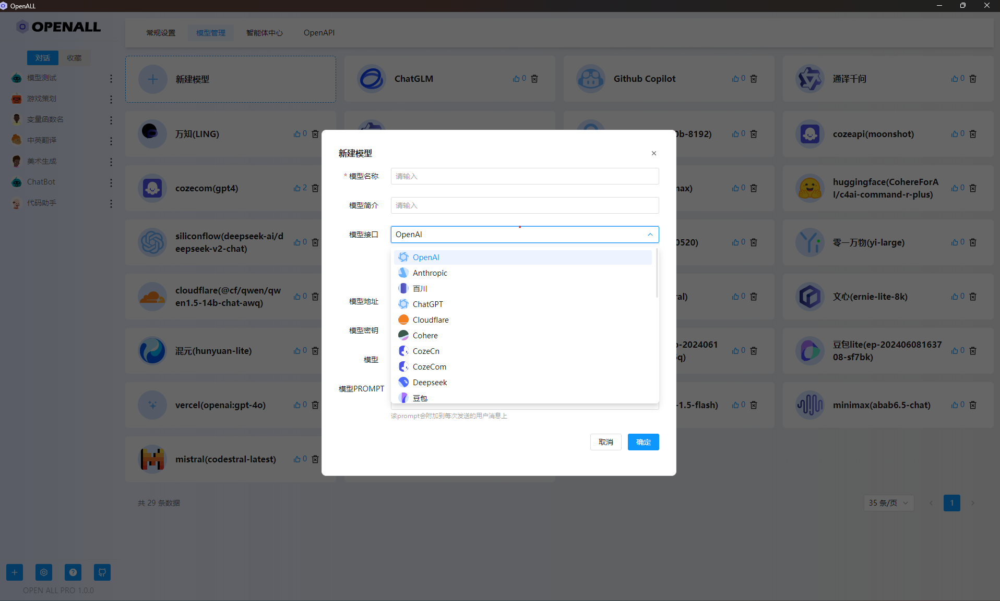

  
  
🚀 Power Your World with AI - Explore, Extend, Empower.

</h2>

# Open All

[![License][License-image]][License-url]
[![Releases][Releases-image]][Releases-url]
[![Wiki][Wiki-image]][Wiki-url]
[![PR][PRs-image]][PRs-url]

[License-image]: https://img.shields.io/github/license/godgodgame/open-all?label=License&style=flat-square&color=orange
[Releases-image]: https://img.shields.io/github/release/godgodgame/open-all?label=Release&style=flat-square&color=blue
[Wiki-image]: https://img.shields.io/badge/wiki-项目文档-black?style=flat-square
[PRs-image]: https://img.shields.io/badge/PRs-welcome-pink?style=flat-square

[License-url]: https://github.com/godgodgame/open-all/blob/master/LICENSE
[Releases-url]: https://github.com/godgodgame/open-all/releases
[Wiki-url]: https://github.com/godgodgame/open-all/wiki
[PRs-url]: https://github.com/godgodgame/open-all/pulls

  
  

## 简介

Open All是一款强大的工具，允许用户通过 API 同时与多个大模型语言进行聊天。该软件支持现今网络上常用的大语言模型，提供了一个统一的接口，使用户能够轻松集成和使用各种大模型语言的聊天功能。

## 演示

|Preview|Preview|
|---|---|
|||

## 功能
1. 支持多种大模型：
   + [Anthropic Claude 模型](https://anthropic.com) 
   + [Google Gemini 模型](https://developers.generativeai.google)
   + [Mistral 模型](https://mistral.ai/)
   + [字节跳动豆包大模型](https://console.volcengine.com/ark/region:ark+cn-beijing/model)
   + [百度文心一言模型](https://cloud.baidu.com/doc/WENXINWORKSHOP/index.html)
   + [阿里通义千问模型](https://help.aliyun.com/document_detail/2400395.html)
   + [讯飞星火认知大模型](https://www.xfyun.cn/doc/spark/Web.html)
   + [智谱 ChatGLM 模型](https://bigmodel.cn)
   + [腾讯混元大模型](https://cloud.tencent.com/document/product/1729)
   + [Moonshot AI](https://platform.moonshot.cn/)
   + [百川大模型](https://platform.baichuan-ai.com)
   + [MINIMAX](https://api.minimax.chat/)
   + [Groq](https://wow.groq.com/)
   + [零一万物](https://platform.lingyiwanwu.com/)
   + [阶跃星辰](https://platform.stepfun.com/)
   + [CozeCn](https://www.coze.cn/)
   + [CozeCom](https://www.coze.com/)
   + [Cohere](https://cohere.com/)
   + [DeepSeek](https://www.deepseek.com/)
   + [Cloudflare Workers AI](https://developers.cloudflare.com/workers-ai/)

2. 兼容符合OpenAI接口的大语言模型
3. 同时和多个大语言模型聊天
4. 自定义智能体

## 贡献

欢迎对本项目进行贡献！如果你有任何建议或发现了问题，请提交 issue 或 pull request。

## Star history

## 许可证

详细信息请参阅[LICENSE](https://github.com/godgodgame/open-all/blob/main/LICENSE)文件。
 
 