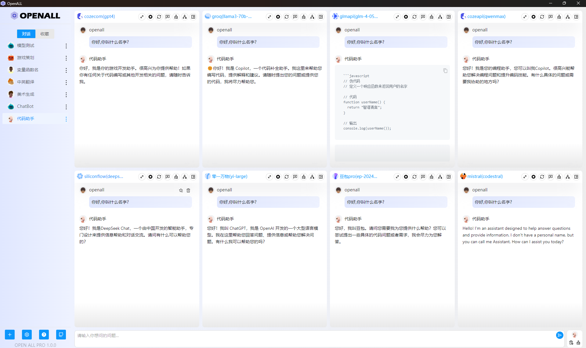

  
  
🚀 Power Your World with AI - Explore, Extend, Empower.

</h2>

# Open All

[![License][License-image]][License-url]
[![Releases][Releases-image]][Releases-url]
[![Wiki][Wiki-image]][Wiki-url]
[![PR][PRs-image]][PRs-url]

[License-image]: https://img.shields.io/github/license/godgodgame/open-all?label=License&style=flat-square&color=orange
[Releases-image]: https://img.shields.io/github/release/godgodgame/open-all?label=Release&style=flat-square&color=blue
[Wiki-image]: https://img.shields.io/badge/wiki-项目文档-black?style=flat-square
[PRs-image]: https://img.shields.io/badge/PRs-welcome-pink?style=flat-square

[License-url]: https://github.com/godgodgame/open-all/blob/master/LICENSE
[Releases-url]: https://github.com/godgodgame/open-all/releases
[Wiki-url]: https://github.com/godgodgame/open-all/wiki
[PRs-url]: https://github.com/godgodgame/open-all/pulls

  
  

## Introduction

Open All is a powerful tool that allows users to chat with multiple large model languages simultaneously through APIs. The software supports popular large language models available on the internet and provides a unified interface for users to easily integrate and use the chat functionality of various large model languages.

## Demo 

|Preview|Preview|
|---|---|
|||

## Features
1. Support for multiple large models:
   + [Anthropic Claude  models](https://anthropic.com)
   + [Google Gemini  models](https://developers.generativeai.google)
   + [Mistral  models](https://mistral.ai/)
   + [ByteDance Doubao large model](https://console.volcengine.com/ark/region:ark+cn-beijing/model)
   + [Baidu ERNIE  models](https://cloud.baidu.com/doc/WENXINWORKSHOP/index.html)
   + [Alibaba Tongyi Qianwen  models](https://help.aliyun.com/document_detail/2400395.html)
   + [iFLYTEK Xinghuo Cognitive Large Model](https://www.xfyun.cn/doc/spark/Web.html)
   + [Zhipu ChatGLM  models](https://bigmodel.cn)
   + [Tencent Mixtral large model](https://cloud.tencent.com/document/product/1729)
   + [Moonshot AI](https://platform.moonshot.cn/)
   + [Baichuan large model](https://platform.baichuan-ai.com)
   + [MINIMAX](https://api.minimax.chat/)
   + [Groq](https://wow.groq.com/)
   + [Lingyi Wanwu](https://platform.lingyiwanwu.com/)
   + [Jieyue Xingchen](https://platform.stepfun.com/)
   + [CozeCn](https://www.coze.cn/)
   + [CozeCom](https://www.coze.com/)
   + [Cohere](https://cohere.com/)
   + [DeepSeek](https://www.deepseek.com/)
   + [Cloudflare Workers AI](https://developers.cloudflare.com/workers-ai/)

2. Compatible with large language models that conform to the OpenAI interface
3. Chat with multiple large language models simultaneously
4. Customizable agents

## Contributing

Contributions are welcome! If you have any suggestions or issues, please submit an issue or pull request.

## Star history

## License

See the [LICENSE](https://github.com/godgodgame/open-all/blob/main/LICENSE) file for details.